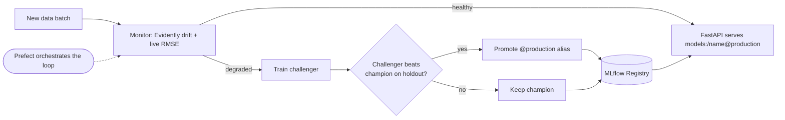

# demand-forecast-mlops


An end-to-end **MLOps platform** for demand forecasting: a model that is trained, tracked, registered, served, continuously monitored for drift, and **automatically retrained and promoted when it degrades** — packaged with Docker Compose and deployable to Kubernetes.

The model forecasts hourly bike-rental demand ([UCI Bike Sharing](https://archive.ics.uci.edu/dataset/275/bike+sharing+dataset)) with **LightGBM**. The point of the project isn't the model — it's the **operational loop around it**: detect that the live data has drifted, retrain a challenger, promote it only if it beats the current production model on recent data, and serve the new model with zero code change.

## The lifecycle



## Results

**Baseline model** (trained on the 2011 reference window, scored on a 2011 hold-out):

| Metric | Value |
|--------|-------|
| R²     | 0.941 |
| RMSE   | 33.2  |
| MAE    | 20.6  |

**Drift detection** — scoring the 2011-trained model on October 2012 data (simulated "new data"):

| Signal | Value | Meaning |
|--------|-------|---------|
| Drifted columns | **62%** | the input distribution has shifted |
| Live RMSE | **150.9** (vs 33.2) | the model silently degraded ~4.5× |
| Live R² | 0.59 (vs 0.94) | — |

**Automated retraining** — the pipeline trains a challenger and evaluates champion vs challenger on a held-out slice of the new data:

| Model | Holdout RMSE |
|-------|--------------|
| Champion (2011) | 160.3 |
| Challenger (2011 + new batch) | **67.8** → **promoted** |

The challenger more than halves the error on recent data, so it is promoted to `@production` and served automatically.

## Architecture

- **Training** (`train.py`) — LightGBM, logged to **MLflow** (params, metrics, model artifact), registered in the **MLflow Model Registry** with a `@production` alias.
- **Serving** (`api.py`) — **FastAPI** loads `models:/demand-forecaster@production` from the registry. Because it serves *by alias*, a promoted model rolls out without a code change.
- **Monitoring** (`monitor.py`) — **Evidently** data-drift reports plus live RMSE/MAE/R² on each incoming batch.
- **Orchestration** (`pipeline.py`) — a **Prefect** flow runs monitor → decide → retrain → champion/challenger → promote, on a schedule.
- **Packaging** — **Docker Compose** brings up the MLflow server, the API, and the jobs; **Kubernetes** manifests (`k8s/`) deploy the same stack to a local **kind** cluster.
- **CI** — GitHub Actions: lint (ruff), tests (pytest), and a Docker image build.

## Quickstart

### Local

```bash
uv sync --extra dev
uv run python -m demand_forecast.data.ingest      # download the dataset
uv run python -m demand_forecast.data.simulate    # reference (2011) + monthly batches (2012)
uv run python -m demand_forecast.train            # train + register + promote v1
uv run uvicorn demand_forecast.api:app --port 8000
```

Open http://localhost:8000 to predict. Run the monitoring + auto-retrain loop on a batch:

```bash
uv run python -m demand_forecast.pipeline 2012-10
```

### Docker Compose

```bash
docker compose build
docker compose up -d mlflow
docker compose run --rm trainer      # register v1 into the MLflow server
docker compose up -d api             # http://localhost:8000
docker compose run --rm pipeline     # monitor -> retrain -> promote
docker compose restart api           # roll out the newly promoted model
```

### Kubernetes (local kind cluster)

See [`k8s/README.md`](k8s/README.md). In short:

```bash
kind create cluster --name demand --image kindest/node:v1.31.2
kind load docker-image demand-forecast-mlops:local --name demand
kubectl apply -f k8s/
kubectl port-forward svc/api 8000:8000 -n demand
```

## The monitoring & retraining loop

Each run of the pipeline:

1. **Monitors** the newest batch — Evidently drift report + live performance against ground truth.
2. **Decides** — retrain if RMSE exceeds a threshold *or* the drifted-column share is high.
3. **Retrains** a challenger on the reference window plus part of the new batch.
4. **Compares** champion vs challenger on a held-out slice of the new batch (no leakage).
5. **Promotes** the challenger to `@production` only if it wins; otherwise keeps the champion.

Because the API resolves the model by alias at load time, promotion is the deployment.

## Project structure

```
src/demand_forecast/
  config.py        paths, feature definitions, MLflow settings
  data/
    ingest.py      download the UCI dataset
    simulate.py    reference window + monthly "new data" batches
  features.py      feature / target selection
  train.py         LightGBM training, MLflow tracking + registry, promotion
  predict.py       load the production model from the registry
  api.py           FastAPI prediction service + UI
  monitor.py       Evidently drift + live performance
  pipeline.py      Prefect flow: monitor -> retrain -> promote
k8s/               Kubernetes manifests (MLflow, API, training Job)
tests/             API and monitoring unit tests
Dockerfile
docker-compose.yml
.github/workflows/ci.yml
```

## Stack

Python · LightGBM · scikit-learn · pandas · MLflow (tracking + registry) · Evidently · Prefect · FastAPI · Docker · Docker Compose · Kubernetes (kind) · GitHub Actions · uv · ruff · pytest